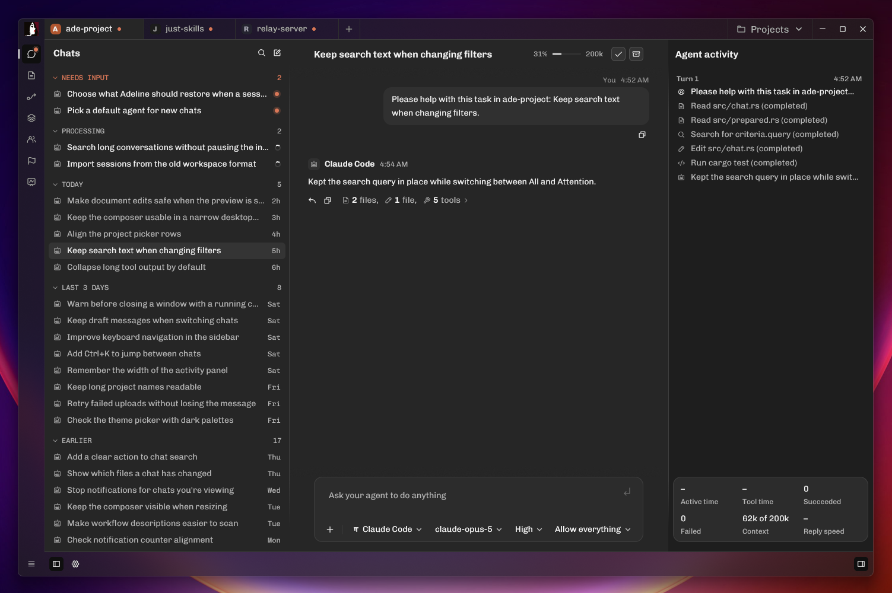

<p align="center">
  
</p>

<p align="center">
  <strong>A native desktop app for running coding agents across your projects.</strong><br />
  Chat with Claude Code, Codex, OpenCode, oh-my-pi, and any other ACP agent in one application. Built with Rust and GPUI for native performance.
</p>

<p align="center">
  <a href="https://github.com/aseeon/adeline/actions/workflows/ci.yml"></a>
  <a href="LICENSE"></a>
  
</p>

<p align="center">
  
</p>

Adeline is an agentic development environment written in Rust. It keeps your projects, agents, and conversations in one fast native app. Agents keep working after you close the window, and every conversation is saved to disk.

> [!NOTE]
> Adeline is in early development. Expect missing features and breaking changes between versions.

## Features

- **Any ACP agent.** Pick a harness from the [Agent Client Protocol registry](https://github.com/agentclientprotocol/registry), or point Adeline at any command that speaks ACP.
- **Saved agents.** Give each agent a name, harness, model, effort level, and default permission mode, then reuse it across projects.
- **Projects and conversations.** Each project has its own working directory and its own list of chats. Complete or archive a chat to close its agent and keep its history.
- **Switch models mid-chat.** Change the model or effort level of a running conversation without touching the agent's defaults.
- **Permission control.** Choose per conversation whether the agent asks before every action, runs reads on its own, or runs everything.
- **Runs in the background.** Agents keep working when you switch chats or close Adeline. Open several windows and they all see the same live state.
- **Recovery.** Adeline retries failed turns and restores interrupted sessions when the harness supports it.
- **Plain files.** Agents and projects are YAML files under `~/.config/adeline/`. Edit them by hand and Adeline picks up the changes live.

## Supported agents

Adeline works with any harness that speaks the [Agent Client Protocol](https://agentclientprotocol.com). These have been tested:

- [oh-my-pi](https://omp.sh)
- [Claude Code](https://github.com/anthropics/claude-code) through the [claude-agent-acp](https://github.com/agentclientprotocol/claude-agent-acp) adapter
- [Codex](https://github.com/openai/codex) through the [codex-acp](https://github.com/agentclientprotocol/codex-acp) adapter
- [OpenCode](https://opencode.ai)

Adeline runs harnesses that are already installed on your machine. It never downloads or installs them for you. Sign in to each harness on its own before using it in Adeline.

## Install

Download the zip for your platform from the [latest release](https://github.com/aseeon/adeline/releases/latest). Builds are available for Windows (x86_64), macOS (Apple Silicon) and Linux (x86_64). On macOS, unzip it and move `Adeline.app` to Applications.

The `adeline-headless-*` zips are for servers. They run the engine with no window and need no desktop libraries. Adeline installs them by itself on the machines you add, so you only need one to set up a server by hand: take `linux-x86_64` or `linux-aarch64` for a Linux server of that processor.

> [!IMPORTANT]
> The release builds aren't code signed yet, so your system will warn you the first time you open Adeline. To open it anyway:
>
> - **Windows:** when SmartScreen says "Windows protected your PC", click **More info**, then **Run anyway**.
> - **macOS:** open Adeline once and close the warning. Then go to **System Settings › Privacy & Security**, scroll down to the message about Adeline, and click **Open Anyway**. If macOS says the app is damaged, run `xattr -dr com.apple.quarantine /Applications/Adeline.app` in Terminal and open it again.
> - **Linux:** no approval is needed.
>
> If you'd rather not run unsigned software, build Adeline from source instead.

## Build from source

### Requirements

- [Rust](https://rustup.rs). The repository pins the toolchain, so `rustup` installs the right version on first build.
- **Windows:** Visual Studio Build Tools with the "Desktop development with C++" workload and a Windows SDK.
- **macOS:** the full Xcode app. Run `sudo xcode-select --switch /Applications/Xcode.app/Contents/Developer` once.
- **Linux:** a graphical session with a working Vulkan driver. On Ubuntu or Debian, `./scripts/linux` installs the build dependencies.

### Build and run

```bash
git clone https://github.com/aseeon/adeline.git
cd adeline
cargo run --release --locked
```

Windows is the main development platform. macOS and Linux build and pass tests in CI but get less hands-on testing.

### Try it without agents

Demo mode opens a sample workspace with simulated replies. It does not start agents or touch your saved data.

```bash
cargo run --release --locked -- --demo
```

## Getting started

1. Install an ACP harness, for example OpenCode or Codex through codex-acp, and sign in to it.
2. Open Adeline and choose **Agents → Add an Agent**. Pick the harness, model, and effort level.
3. Create a project and select its working directory.
4. Start a new chat and send your first message.

## Contributing

Bug reports are welcome. If something doesn't work, please [open an issue](https://github.com/aseeon/adeline/issues).

Adeline is at an early stage of development and its design still changes often, so pull requests that add features can't be accepted at the moment. Thank you for understanding. Feel free to suggest features in an issue instead.

If you send a pull request that fixes a bug, run the same checks as CI first:

```bash
cargo fmt --all -- --check
./scripts/clippy
cargo nextest run --locked --all-features
```

On Windows, use `scripts\clippy.ps1`. If you don't have nextest, `cargo test --locked` works too.

## Credits

Adeline is built on [GPUI](https://github.com/zed-industries/zed) from the Zed team, [GPUI Kit](https://crates.io/crates/gpui-kit), the [Agent Client Protocol](https://agentclientprotocol.com), and [Phosphor Icons](https://phosphoricons.com).

## License

Adeline is licensed under the [Apache License 2.0](LICENSE).
